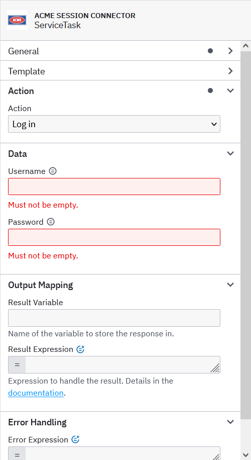

# Template Generator for Camunda Connectors

Generates the template JSON file automatically from the annotated request class and provides utilities for multi values.

# Motivation

Our main goal is to make it easier to implement and maintain connectors for *Java developers*.

# Benefits

- Everything is managed neatly in one class or in several classes grouped by action/function
- Prevents typos and eases the development (no back and forth between request class and template file)
- Avoids common pitfalls by adding required properties and defaults
- A lot less typing because of the defaults and the settings are represented in a more condensed form

This means less time spent implementing, debugging and maintaining the connector without compromising quality while having more time to focus on the connector's functionality and features.

# What Does It Actually Do?

- Most common value is default but can be overridden
- Adds the type as hidden property by default
- Creates standard "Output Mapping" and "Error Handling" unless disabled
- Prints out all the input variables (to be copied in `@OutboundConnector`)
- Populates the binding name and the id of properties with the field name unless overridden
- Offers the possibility to post-process the template definition created from the annotations by implementing the `TemplateProcessor` interface
- Disables FEEL for dropdowns and booleans (schema violation)
- Sets the type to Dropdown if choices are defined
- Possibility to specify property classes for dropdown values, by default those properties are only visible if the corresponding choice is selected
- Group names can be provided for the choice classes, so the group is set automatically too
- Provides an easily extendable collection of classes to deserialize delimited collections

# How to Use It?

All you have to do is annotate the request class with `@TemplateDefinition` and its fields with `@PropertyDefinition`. Set the required properties for the annotations and the optional ones if needed. Anything that might be confusing should be annotated with javadoc. Optionally add a post processor (only required for very special cases). Then either manually execute the template generator or integrate with maven (see below, also for the arguments).

# Example

A very simple connector that lets you log in or log out. The ACME Session Connector returns a token on log in which is required to log out a user.

Since v1.1 it is possible to group the request. This improved version is shown below.

## Form



## Request Class

```java
@Data 
@TemplateDefinition(
        name = "ACME Session Connector",
        id = "com.acme.camunda.connectors.acmeEventConnector:1",
        version = 1,
        icon = "data:image/svg+xml,%3Csvg xmlns='http://www.w3.org/2000/svg' ...",
        groupIds =    {"action"},
        groupLabels = {"Action"}
)
public class Request {

    @PropertyDefinition(
            label = "Action",
            groupId = "action",
            notEmpty = true,
            choiceValues = {"login", "logout"},
            choiceNames = {"Log in", "Log out"},
            value = "login"
    )
    private String action;

    @PropertyDefinition(
            label = "Username",
            groupId = "data",
            notEmpty = true,
            conditionPropertyId = "action",
            conditionEquals = "login"
    )
    private String username;

    @PropertyDefinition(
            label = "Password",
            description = DefaultTexts.SECRETS_SUPPORTED,
            groupId = "data",
            notEmpty = true,
            conditionPropertyId = "action",
            conditionEquals = "login"
    )
    //@Secret (dependency missing here, but all fields that support secrets have to be marked with this annotation)
    private String password;

    @PropertyDefinition(
            label = "Token",
            groupId = "data",
            feel = FEEL.REQUIRED,
            notEmpty = true,
            conditionPropertyId = "action",
            conditionEquals = "logout"
    )
    private String token;

}
```

## Generated Template

```json
{
  "$schema": "https://unpkg.com/@camunda/zeebe-element-templates-json-schema@0.8.0/resources/schema.json",
  "name": "ACME Session Connector",
  "id": "com.acme.camunda.connectors.acmeEventConnector:1",
  "version": 1,
  "icon": {
    "contents": "data:image/svg+xml,%3Csvg xmlns\u003d\u0027http://www.w3.org/2000/svg\u0027 ..."
  },
  "category": {
    "id": "connectors",
    "name": "Connectors"
  },
  "appliesTo": [
    "bpmn:Task"
  ],
  "elementType": {
    "value": "bpmn:ServiceTask"
  },
  "groups": [
    {
      "id": "action",
      "label": "Action"
    },
    {
      "id": "data",
      "label": "Data"
    },
    {
      "id": "output",
      "label": "Output Mapping"
    },
    {
      "id": "errors",
      "label": "Error Handling"
    }
  ],
  "properties": [
    {
      "type": "Hidden",
      "binding": {
        "type": "zeebe:taskDefinition:type"
      },
      "value": "com.acme.camunda.connectors.acmeEventConnector:1"
    },
    {
      "id": "action",
      "label": "Action",
      "group": "action",
      "type": "Dropdown",
      "binding": {
        "type": "zeebe:input",
        "name": "action"
      },
      "value": "login",
      "choices": [
        {
          "value": "login",
          "name": "Log in"
        },
        {
          "value": "logout",
          "name": "Log out"
        }
      ],
      "constraints": {
        "notEmpty": true
      }
    },
    {
      "id": "username",
      "label": "Username",
      "group": "data",
      "type": "String",
      "feel": "optional",
      "binding": {
        "type": "zeebe:input",
        "name": "username"
      },
      "constraints": {
        "notEmpty": true
      },
      "condition": {
        "property": "action",
        "equals": "login"
      }
    },
    {
      "id": "password",
      "label": "Password",
      "description": "\u003ca href\u003d\"https://docs.camunda.io/docs/components/connectors/use-connectors/#using-secrets\" target\u003d\"_blank\"\u003eSecrets\u003c/a\u003e supported.",
      "group": "data",
      "type": "String",
      "feel": "optional",
      "binding": {
        "type": "zeebe:input",
        "name": "password"
      },
      "constraints": {
        "notEmpty": true
      },
      "condition": {
        "property": "action",
        "equals": "login"
      }
    },
    {
      "id": "token",
      "label": "Token",
      "group": "data",
      "type": "String",
      "feel": "required",
      "binding": {
        "type": "zeebe:input",
        "name": "token"
      },
      "constraints": {
        "notEmpty": true
      },
      "condition": {
        "property": "action",
        "equals": "logout"
      }
    },
    {
      "label": "Result Variable",
      "description": "Name of the variable to store the response in.",
      "group": "output",
      "type": "String",
      "binding": {
        "type": "zeebe:taskHeader",
        "key": "resultVariable"
      }
    },
    {
      "label": "Result Expression",
      "description": "Expression to handle the result. Details in the \u003ca href\u003d\"https://docs.camunda.io/docs/components/connectors/use-connectors/\" target\u003d\"_blank\"\u003edocumentation\u003c/a\u003e.",
      "group": "output",
      "type": "Text",
      "feel": "required",
      "binding": {
        "type": "zeebe:taskHeader",
        "key": "resultExpression"
      }
    },
    {
      "label": "Error Expression",
      "description": "Expression to handle errors. Details in the \u003ca href\u003d\"https://docs.camunda.io/docs/components/connectors/use-connectors/\" target\u003d\"_blank\"\u003edocumentation\u003c/a\u003e.",
      "group": "errors",
      "type": "Text",
      "feel": "required",
      "binding": {
        "type": "zeebe:taskHeader",
        "key": "errorExpression"
      }
    }
  ]
}
```

## Output

```text
Input variables (to be copied in @OutboundConnector):
{"action", "username", "password", "token"}
```

# Grouped Example

This is the same example as above but grouped. The only difference is that we use two separate groups for the login data and the logout data and not a common data group. So apart from that the generated template is exactly the same.

The advantages compared to the other version:

- Don't need to specify conditions or groups for the properties
- Easier to manage, especially if there are a lot of fields and actions

To deserialize a request we can use `Deserializer.deserialize(json, gson, clazz)`, where ...

- `json` is the JSON string of the request
- `gson` is our custom `Gson` instance, this allows us to use custom deserializers as before without having to change anything (with the exception that it has to ignore unknown properties and cannot throw an exception)
- `clazz` is the template definition class

```java
@Data
@TemplateDefinition(
        name = "ACME Session Connector",
        id = "com.acme.camunda.connectors.acmeEventConnector:1",
        version = 1,
        icon = "data:image/svg+xml,%3Csvg xmlns='http://www.w3.org/2000/svg' ...",
        groupIds =    {"action", "data"},
        groupLabels = {"Action", "Data"}
)
public class GroupedRequest {

    @PropertyDefinition(
            label = "Action",
            groupId = "action",
            notEmpty = true,
            choiceValues = {"login", "logout"},
            choiceNames = {"Log in", "Log out"},
            choiceClasses = {LoginGroup.class, LogoutGroup.class}, // <--
            choiceGroupNames = {"Login Data", "Logout Data"}, // <--
            value = "login"
    )
    private String action;

    // setters are required (specifically a method starting with "set" and 1 parameter), 
    // those are generated by the @Data annotation here, also all properties have to have
    // distinct names, one way of ensuring this is to prefix the properties in nested classes
    private LoginGroup login;
    private LogoutGroup logout;

}
```

```java
@Data
public class LoginGroup {

    @PropertyDefinition(
            label = "Username",
            notEmpty = true
    )
    private String username;

    @PropertyDefinition(
            label = "Password",
            description = DefaultTexts.SECRETS_SUPPORTED,
            notEmpty = true
    )
    //@Secret (dependency missing here, but all fields that support secrets have to be marked with this annotation)
    private String password;
}
```

```java
@Data
public class LogoutGroup {

    @PropertyDefinition(
            label = "Token",
            feel = FEEL.REQUIRED,
            notEmpty = true
    )
    private String token;
}
```

# Maven Integration

Releases can be found on [maven central](https://central.sonatype.com/artifact/ch.brix.camunda.connector/connector-utils).

```xml
<dependency>
  <groupId>ch.brix.camunda.connector</groupId>
  <artifactId>connector-utils</artifactId>
  <version>1.1.0</version>
</dependency>
```

## Automated template generation

Relevant settings are marked with comments below.

```xml
  <build>
    <plugins>
      <plugin>
        <groupId>org.codehaus.mojo</groupId>
        <artifactId>exec-maven-plugin</artifactId>
        <version>3.1.0</version>
        <executions>
          <execution>
            <id>generate-template</id>
            <!-- Phase in which the template is generated -->
            <phase>prepare-package</phase>
            <goals>
              <goal>java</goal>
            </goals>
          </execution>
        </executions>
        <configuration>
          <mainClass>ch.brix.camunda.connector.util.templateGenerator.TemplateGenerator</mainClass>
          <arguments>
            <!-- Request class -->
            <argument>com.acme.camunda.connector.acmeSessionConnector.Request</argument>
            <!-- Template location (relative if possible) -->
            <argument>element-templates/template-connector.json</argument>
            <!-- PostProcessor class (optional) -->
            <!--argument>com.acme.camunda.connector.acmeSessionConnector.PostProcessor</argument-->
          </arguments>
        </configuration>
      </plugin>
    </plugins>
  </build>
```

# Multi Values

Currently, there is no type for properties that lets us create collections (e.g. by having a button "add value" in the modeler for those types).
So the only way of having a dynamic number of values for a property (without creating placeholders propX0, propX1, propX2, ... and without creating a frontend extension) is to specify those values comma-separated (or otherwise delimited).
That's why we created a Gson adapter for delimited collections.

## Delimited Collections

The `delimitedCollections` package provides some utils to facilitate the work with delimited collections:

- `lists` package contains implementations for comma-separated lists (`ArrayList`) of types `Double`, `Integer`, `Locale`, `Long` and `String`.
- `sets` package contains implementations for comma-separated sets (`HashSet`) of types `Double`, `Integer`, `Locale`, `Long` and `String`.
- `DelimitedCollectionsAdapter` serializes and deserializes delimited collections.
- `DelimitedCollection` is the interface a class has to implement in order to be handled by the adapter.
- `Demo` shows how the adapter is registered and the types can be used.

# Comments / Recommendations

## Lombok

[Project Lombok](https://projectlombok.org/) is recommended to get rid of boilerplate code like getters, setters, equals, hashcode, constructors and builders.

## Validation

[jakarta validation](https://jakarta.ee/specifications/bean-validation/3.0/jakarta-bean-validation-spec-3.0.html) (ex javax) is highly recommended. Baeldung has a [basic validation tutorial](https://www.baeldung.com/javax-validation) and also an article about [how to use validation groups](https://www.baeldung.com/javax-validation-groups). So we can express the validation constraints in the Request class too, e.g.:

```java
@PropertyDefinition(...)
@NotNull(groups = {LogIn.class, LogOut.class})
private Action action;

@PropertyDefinition(...)
@NotBlank(groups = LogIn.class, message = "username missing")
private String username;
```

Enums can be used to ensure we get an existing dropdown value:

```java
public enum Action {
    @SerializedName("login") LOGIN,
    @SerializedName("logout") LOGOUT
}
```

The validation becomes even more powerful when combined with custom classes and custom JSON mappers. E.g. instead of `String username` we could have an object `Username username` that can really validate the username by checking whether it exists or complies to the naming convention. For the JSON mapping see below. Example with propagation and conversion:

```java
@PropertyDefinition(...)
@Valid @NotNull(groups = LogIn.class)
@ConvertGroup(from = LogIn.class, to = Exists.class)
private Username username;
```

## JSON Mapping

Custom objects and deserialization makes working with the request much more comfortable. Instead of `String username` we can have an object `Username username` that provides all required functionalities like `User getUser()` to get the user object from the username. So we don't have to use the user service and process the response etc. because it is all done automatically when calling `getUser()`. Our implementation of delimited collections is an example of how to leverage the power of Gson.

It is even more comfortable if you create your own `io.camunda.zeebe.client.api.JsonMapper` for your connector runtime, then you don't have to manually deserialize the request in the connectors. But be careful, because then your connector depends on the runtime.

# Who Are We?

We are [brix IT solutions](https://www.brix.ch/), a Swiss company known for DAM, but expanding in BPM because we think this is the future. We would like to transition i.e. apply our expertise from writing countless connectors and extensions for DAM to Camunda, especially Camunda Connectors.

We are new to Open Source. If there is anything that can be improved let us know, also if you would like to contribute to this project. In the future we would like to release other connector utilities.

## What's Our Setup?

We use Spring Boot 3+ (Spring 6+), jakarta validation and a custom connector runtime with complete Camunda setup which deploys processes and decisions and includes connectors through dependencies (one such setup per customer per stage). Thanks to docker compose it can be built and updated very easily.

# Release Notes

## 1.0

- Initial public release

## 1.1

- Added `choiceClasses` and `choiceGroupNames` to `PropertyDefinition` to be able to group the request by action (a property class per action)
- Added a `Deserializer` to facilitate the deserialization of nested requests using the new grouping feature
- Added `acmeSessionConnector.grouped` package with a grouped version of the existing example including deserialization
- Fixed `TemplateProcessor`: was called after file creation